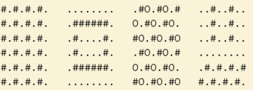

# 🟦 04_loopar_och_listor

## Beskrivning
Projektet "04_loopar_och_listor" innehåller lösningen av veckouppgift 3 under 
YH-kursen Testautomation med Python vid NBI Handelsakademin.  
Uppgiften omfattar 6 programmeringsuppgifter som redovisas 
i en fil (***main.py***) på GitHub. 

## Innehåll
1. Diskutera i grupp (Skriv ner vad du tror kommer skrivas ut)
2. Öva på loopar och listor
3. Kvittouträknaren
4. Figurer med loopar
5. Gissa talet
6. Todo list (att göra-lista)

### 1️⃣ Diskutera i grupp
Uppgiften innehåller 6 olika uppgifter som innehåller while- eller 
for-loopar. Eleven ska gissa vad som kommer att skrivas ut av koden 
och därefter provköra den. I några uppgifter ska eleven ändra i koden 
så att det som skrivs ut ändras.

### 2️⃣ Öva på loopar och listor
Uppgiften innehåller uppgifter där tal ska summeras i en loop. Både for- 
och while-loop ska användas. I sista uppgiften övas manipulation av en
lista med strängar i åtta delmoment.

### 3️⃣  Kvittouträknaren
Uppgiften innebär att man ska skriva ett program där användaren kan mata
in prisbelopp. När användaren väljer att avsluta ska programmet summera 
prisbelopp och presentera summan att betala. 

I en vidareutveckling av programmet ska användaren kunna ange hur många 
gäster som ska dela på notan. Programmet ska då presentera vad varje gäst ska betala. 

I den slutliga versionen ska användaren frågas hur många procent dricks man vill lägga 
på summan. Om ingen dricks anges ska programmet automatiskt lägga på 10 %.

Det är ett plus om programmet innehåller felhantering för att förhindra krasher.
Framförallt är det "ValueError" som ska hanteras vid inmatning av prisbelopp och 
avslutning av programmet.

### 4️⃣ Figurer med loopar
En uppgift där man med hjälp av nästade loopar ska rita upp ett mönster med ett antal 
ascii-tecken. Uppgiften krävde att man använder logiska if-satser för att avgöra tecknens
placering i mönstret. Totalt omfattade uppgiften 10 olika mönster att rita.

Exempel:

## 📊 Status

Här nedan presenteras en översikt över statusen på lösande av uppgfterna.

| Uppgift                     | Status |
|:----------------------------|:------:|
| 1. Diskutera i grupp        |   🟢   |
| 2. Öva på loopar och listor |   🟢   |
| 3. Kvittouträknaren         |   🟢   |
| 4. Figurer med loopar       |   🟢   |
| 5. Gissa talet              |   🟡   |
| 6. Todo list (att göra-lista)             |   🔴   |

> ⚠️ Projektet är under utveckling
